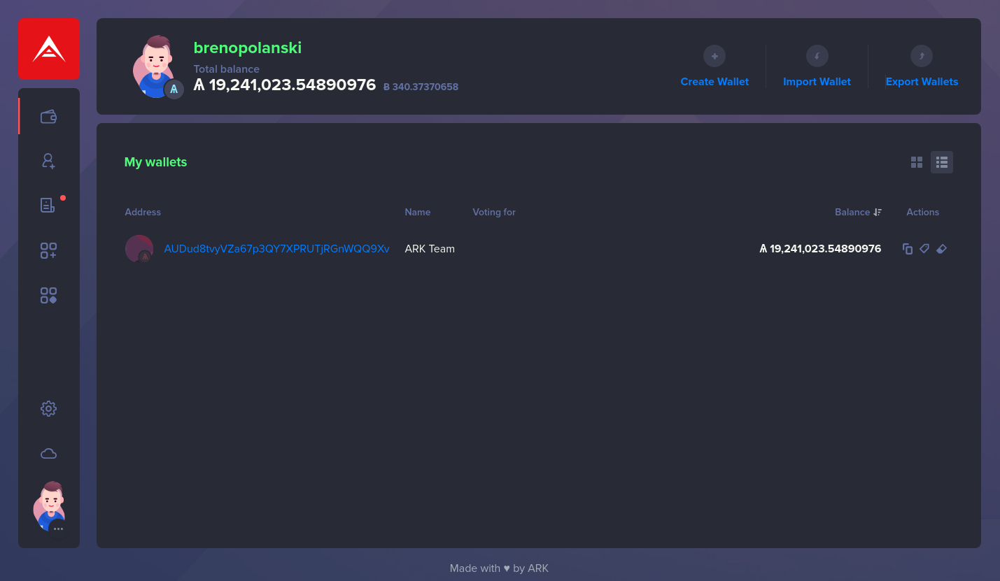

# Dracula for [ARK Desktop Wallet](https://ark.io/wallet)

> A dark theme for [ARK Desktop Wallet](https://ark.io/wallet).

## Installation

1. Clone this repository or [download it](https://github.com/brenopolanski/dracula-theme-ark-wallet/archive/master.zip) and unzip it into `~/.ark-desktop/plugins/`.
2. Start the desktop wallet.
3. Enable the plugin on the plugin section.
4. Change theme in the Settings menu, on the sidebar.

## Team

This theme is maintained by the following person(s) and a bunch of [awesome contributors](https://github.com/brenopolanski/dracula-theme-ark-wallet/graphs/contributors).

| 
| :---: |
| [Breno Polanski](https://github.com/brenopolanski) |

## Contributing

If you want to help, please read the [Contributing](./CONTRIBUTING.md) guide.

## Credits

- [Dracula Theme](https://github.com/dracula/dracula-theme#dracula-theme)

## License

[MIT License](https://brenopolanski.mit-license.org/) © Breno Polanski
